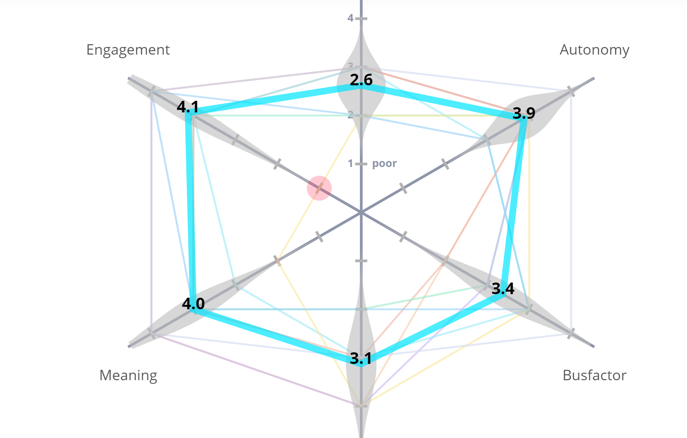

# Meeting Note for 05/14/2021
### Type of Meeting: retrospective
### Attendance: No absence
### time: 4:00pm-5:00pm(Pacific)
### Agenda
- Do meeting to complete first retrospective
### Decisions Made
- How everyone think about last sprint? (The most important three categories are in bold)
  - Mad (that frustrated you in the last iteration.)
    - Programming Difficulty
      - Using JavaScript
      - Inexperience
    - <strong>GitHub Issues</strong>
      - Dealing with pull requests/issues/reviews in GitHub can sometimes be frustrating.
      - Pull request testers made people have to revise a lot.
      - JSdoc generates documents inside the docker instead of our GitHub repo.
    - Meetings
      - There was a lot of meetings and some meetings are too long.
    - Communication
      - Collaborating virtually is much harder than communicating in-person.
      - Communication through slack is patchy sometimes.
      - Imbalance in complexity of work between teams.
      - Unclear timeline in the beginning.
  - Sad (things that disappointed you in the last iteration.)
    - There is a lot going on and this class seems overwhelming.
    - Time Pressure
      - It is the end of week 7.
      - Did not get as much done as planned for subteam.
      - cannot find a way to upload codacy coverage report.
  - Glad (things that excited you in the last iteration.)
    - <strong>Sprint Completion </strong>
      - Everyone finished their assigned stories.
      - Implemented a good amount of work.
      - Nice to have something down and see the framework coming together.
      - Got the backend wroking nicely.
      - We had realistic expecations and completed the stroies we need to.
      - Have fun doing the assigned stories.
    - <strong>Communication</strong>
      - Did not have any falling-out arguments.
    - Learning
      - Learn a lot about JavaScript and GitHub.
      - Once GitHub is figured out, then it is nice.
- How you feel at work?
 
 The top is clarity and the bottom one is Mastery. 

