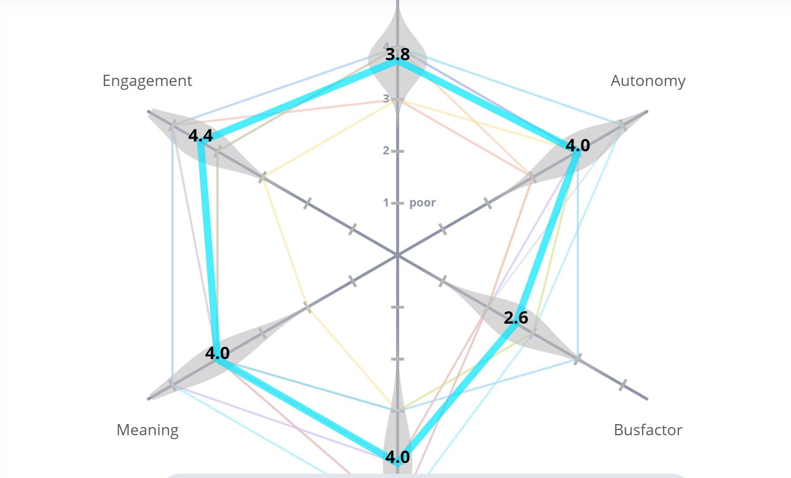

# Meeting Note for 05/31/2021
### Type of Meeting: retrospective
### Attendance: No absence
### time: 5:00pm-6:00pm(Pacific)
### Agenda
- Do meeting to complete second retrospective
### Decisions Made
- How's your team work env?
  - Clarity: how clear on assigned task.
  - Autonomy: how much control over what you work on.
  - Busfactor: how much rely on other people.
  - Mastery: how much you feel you learn
  - Meaning: how meaningful you feel about your work.
  - The top missing topic is clarity and the bottom one is mastery.
  
  - Comparing with the last time, all topics excpet the busfactor improves. 
- How everyone think about last sprint?
  - Mad
    - Pipeline
      - codacy's free trail
      - The CI/CD pipeline had a lot of issues
      - jsdoc conflicts
      - pipeline issues made it harder to work on finishing other issues.
      - pipeline did not work for a while.
    - Communication
      - expectations are unclear.
      - No ideas what other groups are doing.
      - It was a little hard to do a task in a group because I needed to be debriefed on everything that was going on.
    - Bus Factor
      - understanding the source code
      - Need to learn many things to make the program work.
    - Time Constraints
      - Very time consuming
      - Reviews took a while sometimes
      - A lot of work, very stressful, very little sleep.
      - can not finish jobs on time
      - quarter is ending so everything is piling on
  - Sad 
    - Sanat always seemed kind of disappointed or like we missed something after every meeting :(
    - sanat wasn't really happy with us that one time and it felt bad because we did try
  - Glad
    - functional
      - things work
      - It's hosted!
    - More Clarity
      - Felt like I had more direction than last time. I knew what I was supposed to be doing.
      - have more understanding on the project
      - We can move on to testing now.
      - Was able to fix things that I missed or broke
    - GitHub
      - Learned a lot about how GitHub actions work.
      - GitHub is easier/clearer
      - Github was a lot less annoying
      - The pipeline is fixed.
    - Communication
      - Communication has been much better this sprint
      - Group members were very helpful when I was stuck
      - Communication was good, I think people used slack very well.
      - Felt like the team trusted me
    - Completed test
      - We're basically done with the product itself
      - Accomplished a lot of things
      - The platform came together
      - Our project looks so cool. I love clicking around and interacting with it.
      - Learnt more about JavaScript
      - Learned a lot!!!!
      - We were able to get a lot done for the app this sprint