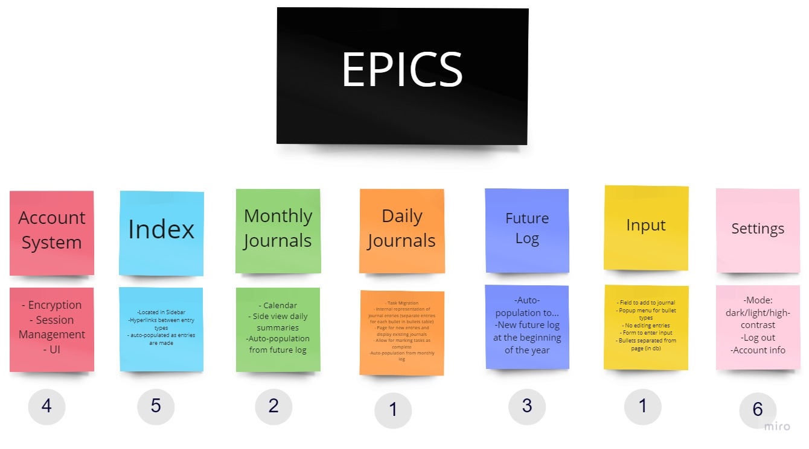
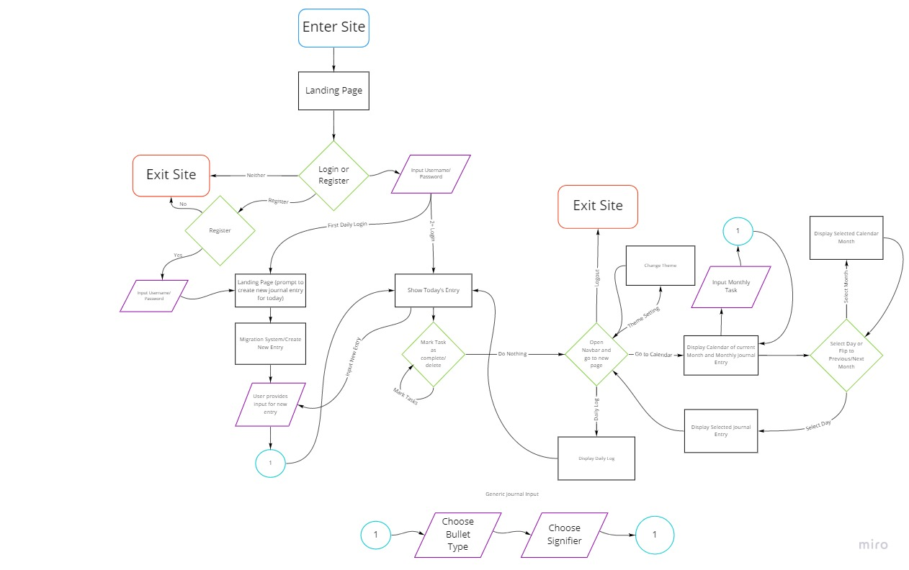
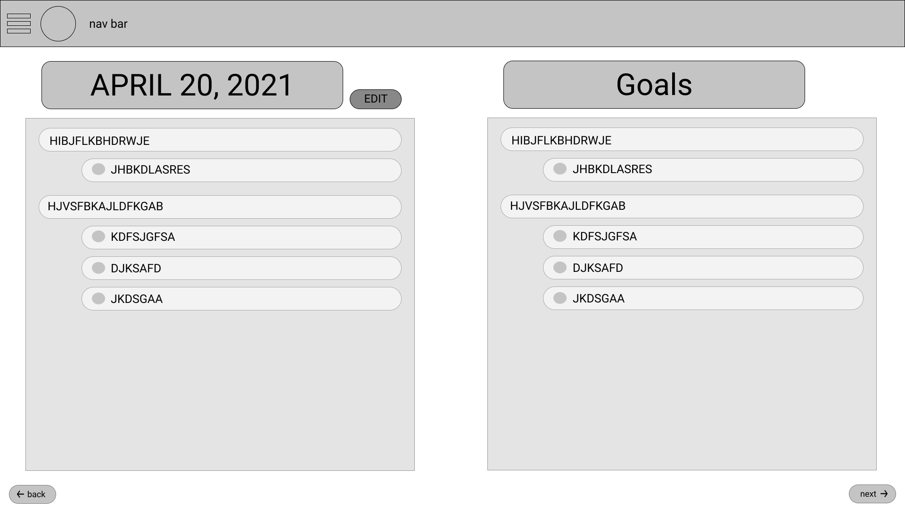
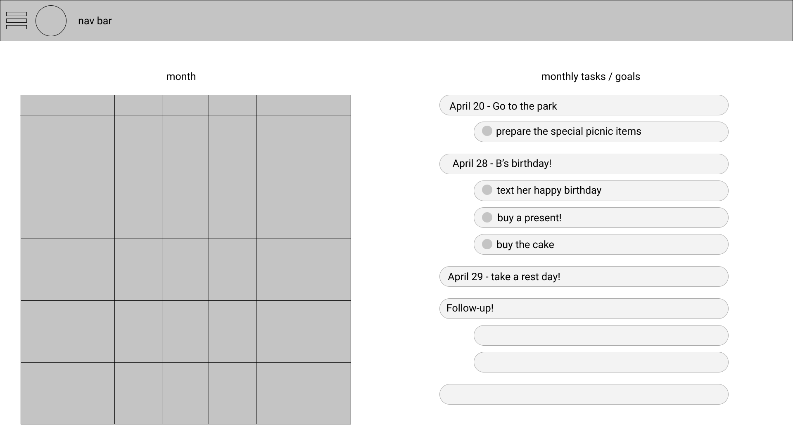
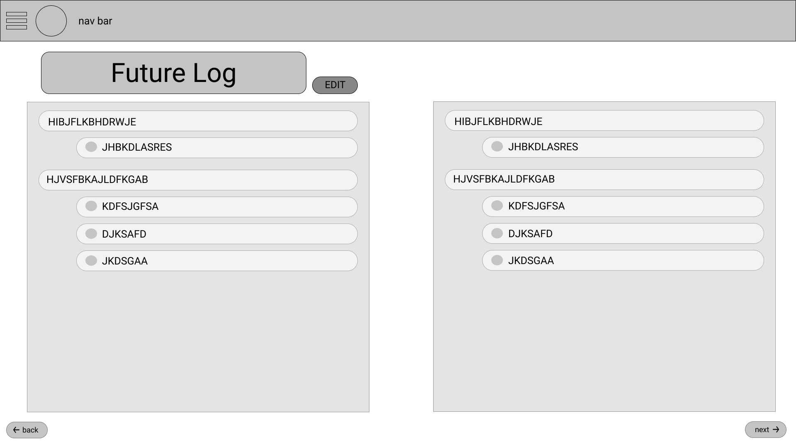

# Statement of Purpose

Our purpose in this pitch is to establish the concept of a bullet journal. (placeholder statement)

# Problem

The bullet journal philosophy is potentially confusing, and its physical limitations hold it back from strictly enforcing the ways of bujo.

Our users are struggling with the restrictions inherent with paper bullet journaling - no auto-population, enforcement is entirely up to user discretion, and navigation can become difficult. It is for these reasons that a digital bullet journal is preferred. Able to restrict a user’s input, we can ensure a user who wants to bullet journal will be guided into the formatting required of the productivity philosophy. 

Because journals contain sensitive material, our system will be account restricted. That way users can log in to their journals on various devices without worrying about their information being accessed by other users. 

# User Personas
Name: Rachael  
Age: 20  
Gender: Female  
Major: Social Science  
Tech fluency: Average  

“I get 3 hours of sleep every day” - Rachael

General Background:
Rachael owns more devices than she knows what to do with, and juggles at least 3 as she goes about her day. She goes to many community service events a day, while also juggling a full course load.

Challenges and Goals:
	Rachael is an active member of her community. Her busy schedule takes her all over the college, and she uses a variety of devices to access her schedule. She has been laying out a general daily schedule in a notepad, however she is finding that it is hard to manage. Recently having discovered the bullet journal philosophy, she wishes to integrate it into her daily routine. To keep track of her day, she wishes to bullet journal but doesn’t want to carry around a physical notebook everywhere she goes. Due to the many locations her daily routine takes her, she needs access to her bullet journal on a variety of devices.

 
 

Name: Dolores  
Age: 76  
Gender: Female  
Tech fluency: Below average  

“I may be retired and blind, but my life is busier than ever” - Dolores

General Background
	She lives in a senior living facility and is an avid gardener. She has her own laptop and a phone. Her husband died a decade ago. She is active in the local gardening community and maintains a small garden outside of her apartment in the building. She’s blind in one eye and has extreme light sensitivity in the other.

Challenges and Goals 
She heard about the bullet journal philosophy from one of her friends at a local senior center. Dolores believes it may be difficult for her to remember the tenants of the bullet journal philosophy and as such she wants a program that rigorously adheres to said philosophy. Having a sensitivity to light, she requires a darker interface for the application. Being forgetful, Dolores would like to be reminded of tasks she has yet to complete from the previous day, like gardening and volunteering. 

 
 

Name: Dave  
Age: 27  
Gender: Chose not to respond  
Tech fluency: Slightly above average  

“Idk man, it’s just so much on my mind rn idk how to keep track of everything without them” - Dave, texting Benji

General Background:
Dave just got out of his second divorce and wants to pick himself up. He has a stressful life being a Marketing Manager, and needs something to help him be organized and put his feelings down. Dave really loves pottery and yoga, which he documents religiously with his Desktop PC, iPhone, and iPad. He has invested his life savings into Dogecoin, which is definitely unrelated to the divorces.

Dave's story (challenges + goals):
His friend Benji recommended yoga, and trying to add it in his weekly routine stresses him out more because there’s just so much he feels like he has to do. He expresses this to his friend, and his friend Benji recommends that Dave start bullet journaling to manage his schedule and as an outlet for his thoughts. Dave actually hates writing on paper now after signing divorce papers, so he wants to find a digital alternative and finds one online called 13ullet. Dave starts planning goals (attending yoga consistently, deadlines for the company, etc) for himself and keeps track of his schedule on a monthly and weekly basis, and is actually enjoying this form of self care mixed with productivity.

# Appetite
We have approximately 5 weeks left, so that is the maximum amount of time to allocate.

Week 6 - 7.5: Daily Journals / Input

Week 7.5 - 8.5: Monthly/Future Journals / Input

Week 8.5 - 9: Account System

Week 9 - beginning of 10: Index/Settings

## Epics Diagram

The numbers beneath the image represent the order in which the epics are to be completed.

# Solution

We decided to create a guided bullet journal that facilitates the bullet journal system in a way that removes the uncertainty and self-management that comes with an analog system. 

## Flow Chart

## Daily Log

The backbone of the journal, the daily log serves as the home of the most granular bulleted thoughts input by the user. It contains events, tasks, and notes, and organizes them according to signifiers. The bullet displayed represents the type of entry, and it can be modified to signify the state of the bullet, such as completion or migrated to the next day. The bullets in entries will be sorted into types and headers will categorize them (using signifiers as categories). Tentatively 100 characters, variable constant. 

## Monthly Log

Contains a calendar linking to the daily logs for the month, though any days that have not yet occurred do not link, as daily logs do not exist until their day comes. It also contains the monthly log entry to the right of the calendar. It functions akin to the daily log except it is for the entire month.

## Future Log

A monthly log that can be written for months in the future. Has the restriction of three bullet points per future month. When the month occurs, the user is prompted to migrate the bullets into the now current month.

## Navbar

This screen is where the index is found to easily navigate to specific types of log in the journal, as well as the settings and logout button.

## Migrations

Bullet journaling is in part driven by migrations - should a task not have been completed, or a monthly task becomes a daily task, bullets can be shifted from one journal category to another. For daily tasks, the user is prompted every day to decide which tasks from the previous day should be migrated, along with any monthly tasks that have become relevant for the day. If it is the beginning of a new month, bullets from the future log are prompted to the user so that they can insert them into the now current monthly log if they remain relevant.

# Risks and Rabbit Holes
- Calendar: To avoid complexity, if a day in the calendar has an existing bullet journal entry then clicking on it will link to that day’s entry. On the side you can see your monthly tasks.
- Task bar on month: Will contain monthly, not daily entries. To view daily entries the user must click on the calendar
- On the monthly task list, the tasks are able to be scrolled if they are too long. Flipping the page brings up the next month, which would be a future log if the month lies in the future.
- Index: Contains links to monthly logs in sidebar. Displays current day’s entry if it has been created. Otherwise it will prompt the user to create today’s entry

# No-Gos
- Allowing for the inclusion of media in bullet journal entries - This would require a significant amount of work for a relatively inconsequential feature.
- Editing journal entries - To maintain the core philosphy of a bullet journal, editing will not be possible to emulate the permanence of a real bullet journal.
- No (user defined) aesthetics - To add this kind of customization would distract from the core principles of bullet journaling.
- No nesting - Without drag and drop, which would be nontrivial to implement, there is no simple way to implement nesting with the planned input method.
